# 💸 Titae : 가계부 자산 관리 플랫폼

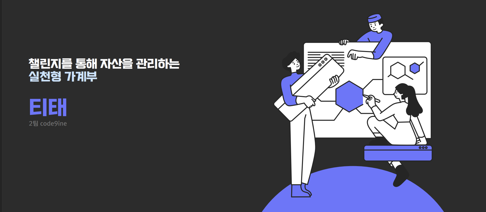

# 🔢 목차
### 1. 프로젝트 소개
### 2. 팀원
### 3. 주요 기능
### 4. 기술 스택
### 5. 폴더 구조
### 6. 시스템 아키텍처
### 7. ERD
### 8. API 명세서
### 9. 플로우차트
### 10. 화면정의서
### 11. 실행 방법

<br>

# 📝 1. 프로젝트 소개

**\<프로젝트 기간 : 2025.06.27 ~ 2025.07.31 \>**

### 티끌모아 부자될 때 까지 함께 동행하는 가계부 자산 관리 플랫폼, 티태
단순한 가계부가 아닌, 미션 기반으로 소비 습관을 개선하는 챌린지형 자산관리 앱
- 가계부 기록에 경험치와 칭호 보상 시스템
- 챗봇과 통계로 사용자 맞춤 소비 피드백 제공
- 미션을 통해 절약을 챌린지처럼 즐기기
- 합리적 소비처를 알려주는 갓플(God Place) 기능

**🌐 프론트엔드 주소**: https://titae.cloud<br>
**🌐 백엔드 주소** : https://api.titae.cloud<br>
**📄 API 문서** : https://api.titae.cloud/swagger-ui.html

<br>

# 💻 2. 팀원

|    이름    |                                                 역할                                                 |
|:--------:|:--------------------------------------------------------------------------------------------------:|
| **안재호** (Backend)  | 백엔드 팀장, AWS 인프라 구축 및 배포<br>GEMINI 챗봇 구현<br>프론트엔드 연동 설정<br>회원 관리, 이메일 인증, 알림 시스템 구현 |
| **김도윤** (Backend)  | 가계부 기능 구현<br>일일챌린지, 월간챌린지 구현 |
| **김찬우** (Backend)  | 공공데이터 포털 API 연동, 축제 및 도서관 데이터 수집<br>KAKAO API 연동<br>BATCH 및 SCHEDULER 처리<br>네이버 OCR 연동, 갓플 검색 기능, 북마크 구현 |
| **손창민** (Backend)  | 커뮤니티 게시글/댓글/좋아요 API 구현<br>커뮤니티 챌린지 구현<br>관리자 기능 구현<br>GCP 기반 Mock 서버 배포 |
| **이지윤** (Frontend)  | PO, 기획 및 디자인<br>퍼블리싱, 가계부 페이지 담당 |
| **이현우** (Frontend)  | 프론트엔드 팀장, 기획 및 디자인<br>퍼블리싱, 로그인/회원가입, 메인 담당 |
| **정지유** (Frontend)  | 기획 및 디자인, 퍼블리싱<br>유저페이지 담당, 404 페이지 |
| **조정우** (Frontend)  | 기획 및 디자인, 퍼블리싱<br>커뮤니티 페이지 담당 |
| **최연서** (Frontend)  | 기획 및 디자인, 퍼블리싱<br>갓플 페이지 담당, 관리자 페이지 담당 |

<br>

# ✨ 3. 주요 기능

### 💰 예산 / 가계부
- 월별 예산 설정 및 지출 내역 기록
- 카테고리별 지출 분석 및 월간 리포트
- Naver Cloud OCR을 활용한 영수증 자동 인식

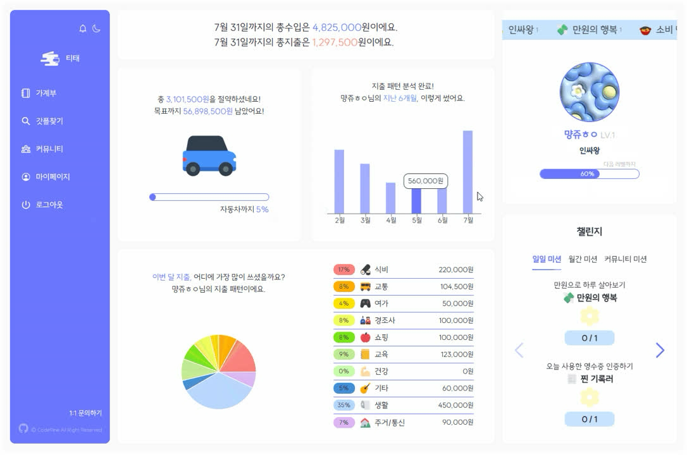
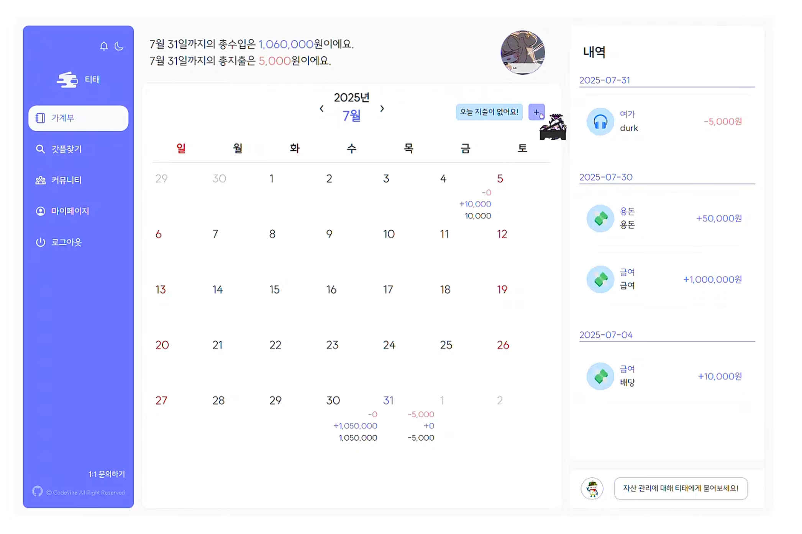

### 📍 장소 검색
- 절약 맛집, 축제, 도서관 등 공공데이터 기반 장소 정보 제공
- 장소 북마크 기능

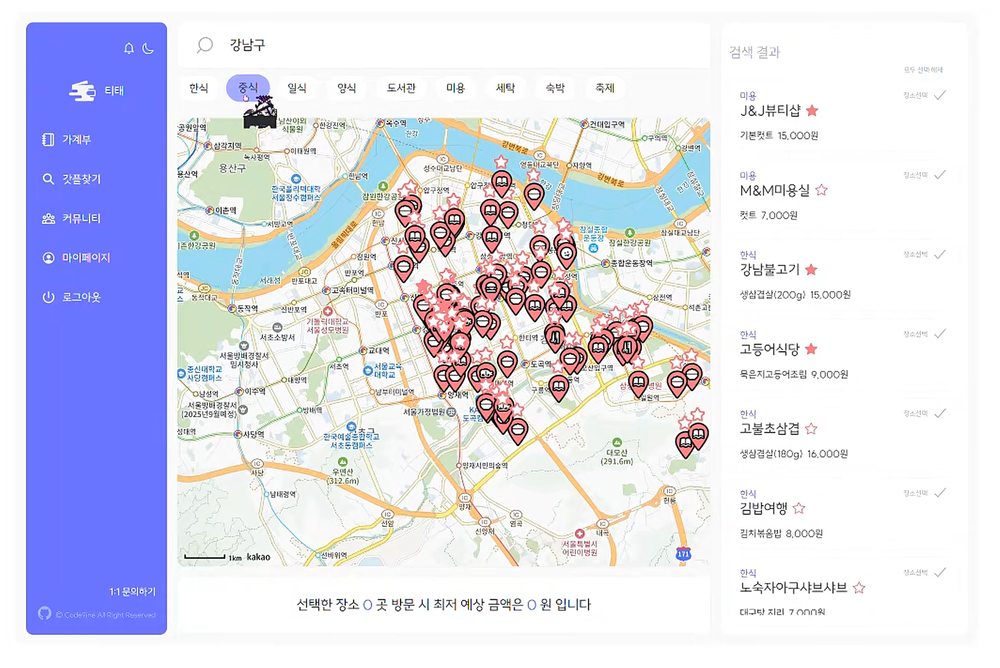
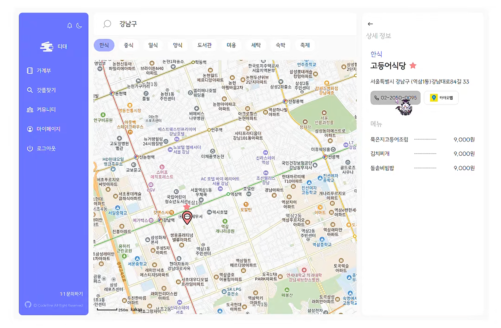

### 💬 커뮤니티
- 카테고리별 게시글 작성·조회·수정·삭제 (MY_STORE, CHALLENGE, FREE)
- 좋아요, 북마크, 댓글 기능
- AWS S3 Presigned URL 기반 이미지 업로드 (최대 8장)
- 게시글 좋아요·댓글 이벤트 기반 알림 발송

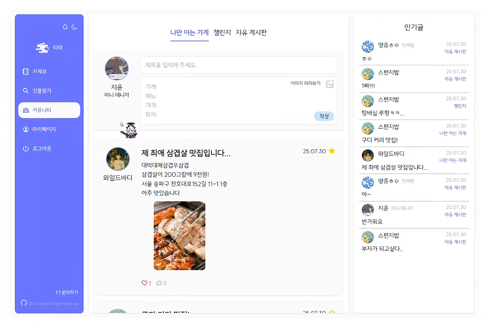
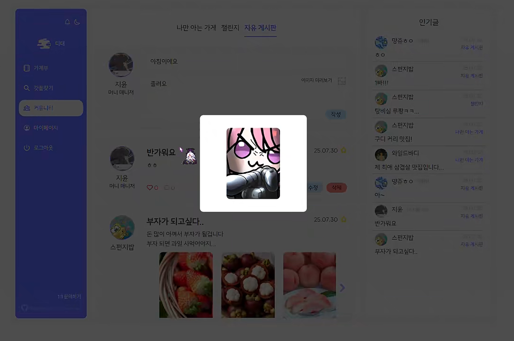

### 🏆 챌린지
- 제로 마스터, 노노카페, 냉털 요리왕 등 다양한 절약 챌린지 참여
- 챌린지 달성 시 업적/칭호 자동 부여
- 챌린지 달성 현황 대시보드 제공

### 🔔 알림
- 좋아요, 댓글, 업적 달성 시 실시간 알림

### 🤖 AI 챗봇
- Google Gemini API 기반 소비 상담 챗봇

### 👤 회원
- 이메일/비밀번호 로그인
- 출석 체크 및 레벨 시스템
- 추천인 코드 기반 초대 기능

<br>

# 🛠️ 4. 기술 스택

## \<Backend\>

### Language
![Java](https://img.shields.io/badge/Java_21-007396?&style=for-the-badge&logo=data:image/svg%2bxml;base64,PCFET0NUWVBFIHN2ZyBQVUJMSUMgIi0vL1czQy8vRFREIFNWRyAxLjEvL0VOIiAiaHR0cDovL3d3dy53My5vcmcvR3JhcGhpY3MvU1ZHLzEuMS9EVEQvc3ZnMTEuZHRkIj4KDTwhLS0gVXBsb2FkZWQgdG86IFNWRyBSZXBvLCB3d3cuc3ZncmVwby5jb20sIFRyYW5zZm9ybWVkIGJ5OiBTVkcgUmVwbyBNaXhlciBUb29scyAtLT4KPHN2ZyB3aWR0aD0iMTUwcHgiIGhlaWdodD0iMTUwcHgiIHZpZXdCb3g9IjAgMCAzMi4wMCAzMi4wMCIgdmVyc2lvbj0iMS4xIiB4bWxucz0iaHR0cDovL3d3dy53My5vcmcvMjAwMC9zdmciIHhtbG5zOnhsaW5rPSJodHRwOi8vd3d3LnczLm9yZy8xOTk5L3hsaW5rIiBmaWxsPSIjZmZmZmZmIiBzdHJva2U9IiNmZmZmZmYiIHN0cm9rZS13aWR0aD0iMC4yNTYiPgoNPGcgaWQ9IlNWR1JlcG9fYmdDYXJyaWVyIiBzdHJva2Utd2lkdGg9IjAiLz4KDTxnIGlkPSJTVkdSZXBvX3RyYWNlckNhcnJpZXIiIHN0cm9rZS1saW5lY2FwPSJyb3VuZCIgc3Ryb2tlLWxpbmVqb2luPSJyb3VuZCIvPgoNPGcgaWQ9IlNWR1JlcG9faWNvbkNhcnJpZXIiPiA8cGF0aCBmaWxsPSIjZmZmZmZmIiBkPSJNMTIuNTU3IDIzLjIyYzAgMC0wLjk4MiAwLjU3MSAwLjY5OSAwLjc2NSAyLjAzNyAwLjIzMiAzLjA3OSAwLjE5OSA1LjMyNC0wLjIyNiAwIDAgMC41OSAwLjM3IDEuNDE1IDAuNjkxLTUuMDMzIDIuMTU3LTExLjM5LTAuMTI1LTcuNDM3LTEuMjN6TTExLjk0MiAyMC40MDVjMCAwLTEuMTAyIDAuODE2IDAuNTgxIDAuOTkgMi4xNzYgMC4yMjQgMy44OTUgMC4yNDMgNi44NjktMC4zMyAwIDAgMC40MTEgMC40MTcgMS4wNTggMC42NDUtNi4wODUgMS43NzktMTIuODYzIDAuMTQtOC41MDgtMS4zMDV6TTE3LjEyNyAxNS42M2MxLjI0IDEuNDI4LTAuMzI2IDIuNzEzLTAuMzI2IDIuNzEzczMuMTQ5LTEuNjI1IDEuNzAzLTMuNjYxYy0xLjM1MS0xLjg5OC0yLjM4Ni0yLjg0MSAzLjIyMS02LjA5MyAwIDAtOC44MDEgMi4xOTgtNC41OTggNy4wNDJ6TTIzLjc4MyAyNS4zMDJjMCAwIDAuNzI3IDAuNTk5LTAuODAxIDEuMDYyLTIuOTA1IDAuODgtMTIuMDkxIDEuMTQ2LTE0LjY0MyAwLjAzNS0wLjkxNy0wLjM5OSAwLjgwMy0wLjk1MyAxLjM0NC0xLjA2OSAwLjU2NC0wLjEyMiAwLjg4Ny0wLjEgMC44ODctMC4xLTEuMDIwLTAuNzE5LTYuNTk0IDEuNDExLTIuODMxIDIuMDIxIDEwLjI2MiAxLjY2NCAxOC43MDYtMC43NDkgMTYuMDQ0LTEuOTV6TTEzLjAyOSAxNy40ODljMCAwLTQuNjczIDEuMTEtMS42NTUgMS41MTMgMS4yNzQgMC4xNzEgMy44MTQgMC4xMzIgNi4xODEtMC4wNjYgMS45MzQtMC4xNjMgMy44NzYtMC41MSAzLjg3Ni0wLjUxcy0wLjY4MiAwLjI5Mi0xLjE3NSAwLjYyOWMtNC43NDUgMS4yNDgtMTMuOTExIDAuNjY3LTExLjI3Mi0wLjYwOSAyLjIzMi0xLjA3OSA0LjA0Ni0wLjk1NiA0LjA0Ni0wLjk1NnpNMjEuNDEyIDIyLjE3NGM0LjgyNC0yLjUwNiAyLjU5My00LjkxNSAxLjAzNy00LjU5MS0wLjM4MiAwLjA3OS0wLjU1MiAwLjE0OC0wLjU1MiAwLjE0OHMwLjE0Mi0wLjIyMiAwLjQxMi0wLjMxOGMzLjA3OS0xLjA4MyA1LjQ0OCAzLjE5My0wLjk5NCA0Ljg4Ny0wIDAgMC4wNzUtMC4wNjcgMC4wOTctMC4xMjZ6TTE4LjUwMyAzLjMzN2MwIDAgMi42NzEgMi42NzItMi41MzQgNi43ODEtNC4xNzQgMy4yOTYtMC45NTIgNS4xNzYtMC4wMDIgNy4zMjMtMi40MzYtMi4xOTgtNC4yMjQtNC4xMzMtMy4wMjUtNS45MzQgMS43NjEtMi42NDQgNi42MzgtMy45MjUgNS41Ni04LjE3ek0xMy41MDMgMjguOTY2YzQuNjMgMC4yOTYgMTEuNzQtMC4xNjQgMTEuOTA4LTIuMzU1IDAgMC0wLjMyNCAwLjgzMS0zLjgyNiAxLjQ5LTMuOTUyIDAuNzQ0LTguODI2IDAuNjU3LTExLjcxNiAwLjE4IDAgMCAwLjU5MiAwLjQ5IDMuNjM1IDAuNjg1eiIvPiA8L2c+Cg08L3N2Zz4=)

### Framework


### Build


### ORM


### Security


### AI


## \<DataBase & Infra\>
### DataBase


### Infra

![AWS EC2](https://img.shields.io/badge/AWS_EC2-FF9900?style=for-the-badge&logo=data:image/svg+xml;base64,PD94bWwgdmVyc2lvbj0iMS4wIiBlbmNvZGluZz0idXRmLTgiPz48IS0tIFVwbG9hZGVkIHRvOiBTVkcgUmVwbywgd3d3LnN2Z3JlcG8uY29tLCBHZW5lcmF0b3I6IFNWRyBSZXBvIE1peGVyIFRvb2xzIC0tPgo8c3ZnIHdpZHRoPSI4MDBweCIgaGVpZ2h0PSI4MDBweCIgdmlld0JveD0iMCAwIDE2IDE2IiB4bWxucz0iaHR0cDovL3d3dy53My5vcmcvMjAwMC9zdmciIGZpbGw9Im5vbmUiPjxwYXRoIGZpbGw9IiM5RDUwMjUiIGQ9Ik0xLjcwMiAyLjk4TDEgMy4zMTJ2OS4zNzZsLjcwMi4zMzIgMi44NDItNC43NzdMMS43MDIgMi45OHoiLz48cGF0aCBmaWxsPSIjRjU4NTM2IiBkPSJNMy4zMzkgMTIuNjU3bC0xLjYzNy4zNjNWMi45OGwxLjYzNy4zNTN2OS4zMjR6Ii8+PHBhdGggZmlsbD0iIzlENTAyNSIgZD0iTTIuNDc2IDIuNjEybC44NjMtLjQwNiA0LjA5NiA2LjIxNi00LjA5NiA1LjM3Mi0uODYzLS40MDZWMi42MTJ6Ii8+PHBhdGggZmlsbD0iI0Y1ODUzNiIgZD0iTTUuMzggMTMuMjQ4bC0yLjA0MS41NDZWMi4yMDZsMi4wNC41NDh2MTAuNDk0eiIvPjxwYXRoIGZpbGw9IiM5RDUwMjUiIGQ9Ik00LjMgMS43NWwxLjA4LS41MTIgNi4wNDMgNy44NjQtNi4wNDMgNS42Ni0xLjA4LS41MTFWMS43NDl6Ii8+PHBhdGggZmlsbD0iI0Y1ODUzNiIgZD0iTTcuOTk4IDEzLjg1NmwtMi42MTguOTA2VjEuMjM4bDIuNjE4LjkwOHYxMS43MXoiLz48cGF0aCBmaWxsPSIjOUQ1MDI1IiBkPSJNNi42MDIuNjZMNy45OTggMGw2LjUzOCA4LjQ1M0w3Ljk5OCAxNmwtMS4zOTYtLjY2Vi42NnoiLz48cGF0aCBmaWxsPSIjRjU4NTM2IiBkPSJNMTUgMTIuNjg2TDcuOTk4IDE2VjBMMTUgMy4zMTR2OS4zNzJ6Ii8+PC9zdmc+)
![AWS S3](https://img.shields.io/badge/AWS_S3-FF9900?style=for-the-badge&logo=data:image/svg+xml;base64,PD94bWwgdmVyc2lvbj0iMS4wIiBlbmNvZGluZz0iVVRGLTgiIHN0YW5kYWxvbmU9Im5vIj8+CjwhLS0gVXBsb2FkZWQgdG86IFNWRyBSZXBvLCB3d3cuc3ZncmVwby5jb20sIEdlbmVyYXRvcjogU1ZHIFJlcG8gTWl4ZXIgVG9vbHMgLS0+Cjxzdmcgd2lkdGg9IjgwMHB4IiBoZWlnaHQ9IjgwMHB4IiB2aWV3Qm94PSItMjcgMCAzMTAgMzEwIiB2ZXJzaW9uPSIxLjEiIHhtbG5zPSJodHRwOi8vd3d3LnczLm9yZy8yMDAwL3N2ZyIgeG1sbnM6eGxpbms9Imh0dHA6Ly93d3cudzMub3JnLzE5OTkveGxpbmsiIHByZXNlcnZlQXNwZWN0UmF0aW89InhNaWRZTWlkIj4KCTxnPgoJCTxwYXRoIGQ9Ik0yMC42MjQsNTMuNjg2IEwwLDY0IEwwLDI0NS4wMiBMMjAuNjI0LDI1NS4yNzQgTDIwLjc0OCwyNTUuMTI1IEwyMC43NDgsNTMuODI4IEwyMC42MjQsNTMuNjg2IiBmaWxsPSIjOEMzMTIzIj4KDTwvcGF0aD4KCQk8cGF0aCBkPSJNMTMxLDIyOSBMMjAuNjI0LDI1NS4yNzQgTDIwLjYyNCw1My42ODYgTDEzMSw3OS4zODcgTDEzMSwyMjkiIGZpbGw9IiNFMDUyNDMiPgoNPC9wYXRoPgoJCTxwYXRoIGQ9Ik04MS4xNzgsMTg3Ljg2NiBMMTI3Ljk5NiwxOTMuODI2IEwxMjguMjksMTkzLjE0OCBMMTI4LjU1MywxMTYuMzc4IEwxMjcuOTk2LDExNS43NzggTDgxLjE3OCwxMjEuNjUyIEw4MS4xNzgsMTg3Ljg2NiIgZmlsbD0iIzhDMzEyMyI+Cg08L3BhdGg+CgkJPHBhdGggZD0iTTEyNy45OTYsMjI5LjI5NSBMMjM1LjM2NywyNTUuMzMgTDIzNS41MzYsMjU1LjA2MSBMMjM1LjUzMyw1My44NjYgTDIzNS4zNjMsNTMuNjg2IEwxMjcuOTk2LDc5LjY4MiBMMTI3Ljk5NiwyMjkuMjk1IiBmaWxsPSIjOEMzMTIzIj4KDTwvcGF0aD4KCQk8cGF0aCBkPSJNMTc0LjgyNywxODcuODY2IEwxMjcuOTk2LDE5My44MjYgTDEyNy45OTYsMTE1Ljc3OCBMMTc0LjgyNywxMjEuNjUyIEwxNzQuODI3LDE4Ny44NjYiIGZpbGw9IiNFMDUyNDMiPgoNPC9wYXRoPgoJCTxwYXRoIGQ9Ik0xNzQuODI3LDg5LjYzMSBMMTI3Ljk5Niw5OC4xNjYgTDgxLjE3OCw4OS42MzEgTDEyNy45MzcsNzcuMzc1IEwxNzQuODI3LDg5LjYzMSIgZmlsbD0iIzVFMUYxOCI+Cg08L3BhdGg+CgkJPHBhdGggZD0iTTE3NC44MjcsMjE5LjgwMSBMMTI3Ljk5NiwyMTEuMjEgTDgxLjE3OCwyMTkuODAxIEwxMjcuOTM5LDIzMi44NTQgTDE3NC44MjcsMjE5LjgwMSIgZmlsbD0iI0YyQjBBOSI+Cg08L3BhdGg+CgkJPHBhdGggZD0iTTgxLjE3OCw4OS42MzEgTDEyNy45OTYsNzguMDQ1IEwxMjguMzc1LDc3LjkyOCBMMTI4LjM3NSwwLjMxMyBMMTI3Ljk5NiwwIEw4MS4xNzgsMjMuNDEzIEw4MS4xNzgsODkuNjMxIiBmaWxsPSIjOEMzMTIzIj4KDTwvcGF0aD4KCQk8cGF0aCBkPSJNMTc0LjgyNyw4OS42MzEgTDEyNy45OTYsNzguMDQ1IEwxMjcuOTk2LDAgTDE3NC44MjcsMjMuNDEzIEwxNzQuODI3LDg5LjYzMSIgZmlsbD0iI0UwNTI0MyI+Cg08L3BhdGg+CgkJPHBhdGggZD0iTTEyNy45OTYsMzA5LjQyOCBMODEuMTczLDI4Ni4wMjMgTDgxLjE3MywyMTkuODA2IEwxMjcuOTk2LDIzMS4zODggTDEyOC42ODUsMjMyLjE3MSBMMTI4LjQ5OCwzMDguMDc3IEwxMjcuOTk2LDMwOS40MjgiIGZpbGw9IiM4QzMxMjMiPgoNPC9wYXRoPgoJCTxwYXRoIGQ9Ik0xMjcuOTk2LDMwOS40MjggTDE3NC44MjMsMjg2LjAyMyBMMTc0LjgyMywyMTkuODA2IEwxMjcuOTk2LDIzMS4zODggTDEyNy45OTYsMzA5LjQyOCIgZmlsbD0iI0UwNTI0MyI+Cg08L3BhdGg+CgkJPHBhdGggZD0iTTIzNS4zNjcsNTMuNjg2IEwyNTYsNjQgTDI1NiwyNDUuMDIgTDIzNS4zNjcsMjU1LjMzIEwyMzUuMzY3LDUzLjY4NiIgZmlsbD0iI0UwNTI0MyI+Cg08L3BhdGg+Cgk8L2c+Cjwvc3ZnPg==)


### External Services

![Kakao Map](https://img.shields.io/badge/Kakao_Map-F7DF1E?style=for-the-badge&logo=data:image/png;base64,iVBORw0KGgoAAAANSUhEUgAAAMwAAADACAMAAAB/Pny7AAAA9lBMVEX/5QAAgcf/6SoAgMj/5wAAf8n/6QAAfsr///8AfcsAgsX/6wAAfM0Ae84Aes//4wD55AAAhcEAhr4AeNH/+9f//N3/9JD/7lT/6z7o3hV+ppp0o5tlnqF/rJDK0zlIoJsAi7dzqJF3rYny4RVKmKhurocAiruSv2SfxFsAj7P/9KL/97r++c7//vP/97P/8oCwyVaWvm6DtIDV1zDC0EOLu3JknKZIla4vj7W1zExws31DkrJ6t3dMpZQ7m6KxxVsmlau+y1XIz0+kvmeVt3VeoppdqI3l2jApn5tWq4mHvWperoMHnKEZmKfZ1EGxw2SSs4P/72hz3rbTAAAJAUlEQVR4nO2df1saRxDHl+7uHXegHjRpcqnyw0OEpqbAkYrGACJKTKu27//N9E4bReXYZXbm4OHhmz/S/hHdDzM7uzs7O7BsNvsbWwN9jEBYNvv7zrIHgiHxJoY5+mnZ48DRu6MI5tNaGIaxnd8jmDUxTGSaLHu7JoaJTHPEfln2GPD0ib1b9hDw9AdbmynD1skujL1f9gAwtUZOtoFZXW1gVlUbmFXVBmZVtYFZVW1gVlWpwIh70f8eWhghrEieHyvw4v8mZaKDiTi8sNXu7H34dfdev37Y67RbYcREBUQEIyzR/Vz987hXL3D7UZlCvXf8Z7VdEjQ8FDDRUFsHx72iKyXnPDOl6H+ldOu92sFJjoAHH0bkwtMvEchzjGdIUhaKx2d+DhsHG0bkuuWimwzyZCO3+LWEjIMLE6HcZNQkjzxlXBxMGCFKfcfWI3nAsZ1yCTFY48EINjlwF0G5l1PoTBgWDhqMCAbNvKaDPbNOfngeINGgwdzu23JxlFi225ng0ODACO98uAVDuTdOf4TiaigwIrgoLjxbpuVU7jwEGgwY4XdswGyZlnTHCBMHAUaE1bwZSiaO0vu+MY05jBVeGrnYI03VOAwYw4jwEhjFXtLwqqltTGEilozhfHmkcU1pDGGEX3WRWGKafbMoYAYjvH08loim0FkmzLiIyBLR1C+sZcFYgwoqS0TTPDegMYERYR8jKD+TfWkQoA1gRLDnYLNENP94S4G5KCA7WSxeH4BNA4cRtzV0J4vlwB0NDCOCMQlLZJsLqKPBYUbYkeyH5PAWaBoojPD3zbfKCXKgxwGwZUa4y+W0ZBNoGiCMCOgMAzcNFOaWzjCRaSqwgAaECTqEholM0wYFNBiMmFCFsgfJIcjPgJYZLGAYLh0nn3cWSqvZI8ioYDDeN90Fk9vbhf7VuN3uXN24W9o8zjXEz0AwItDN9Ntu+XziB4HnBYE/GfRtzQ+BF38C+BkMpqGXvpSy3PXY/xfN8V/eqK+ZYdsapQaj52VOvcGeX1gI4bX1cp/OdWowWp+urIWvT40i1z3WmTm8khKMKG3rDGd3duLICms6n8XPgOAMgbHONAIzr4UJo7FKxxo0W410YHIaU4ZXThIzE1arrqZxrhfPbIBgNMbinuWSf4B1oLaMvJnzAxBhPPWU4cN59y3C76nv1t1UYESohpGNuU5inakj2s+LXz9BYE6USyavzx+J8NWJne2kAIIKY31XBjPl7M2VlTFkq5UKzKky97d1ohiIdaj8QPKHC4czCMy1Ekbp7xrzzjlLBearykU0IpGlnHfO6YrAVJQwOWUAcP5KBUa5AZBDNYwyIQLYApBYRjbVMMobt5Qsc610s6IaRjln8ukEgL/U0Uw1DuEro1lKMJ+Va8R2V7XOqA/egDMAZDujHogyrKrnXWa7lAqMesGTikOv8DT2ZosfNUE5APVBU87fz1iHyl0zL6Rznsk11aeR/rwkngiGyp8g/04HRsPhuTvvQCM+u6ofANmawbIzGjlAPkw+jlhdjbQ7YP7DYHyd+//ES2MR9tX/mhcAVZuwJOBQferl7v5sGiu81Cgesr+lltFUL5vxZ1udkdFkVkmHJbO9+DkTCjPRyRdzt3/ysjZeeIOaDgsvQurogPczf2vRZCr74fQzGSFK1bpW4aBzldr9DGPnOtnm2Di9qxORi5+aWVbOa32ta9ba5W8ho4LeaarXzR84hXr59LDRODztFwu65ZzyBlStCbSMN9auludT0v0323cp3jZHptHIN4Mlh6nWAYigQ1A490MOsK4JXAh0W8GpzZ4hcFkTGCYYk8GAC87g9Wa3GnsakOz+4ilzQxjmtTHrs5/Ei3fQIRnUaE5QXme8koS/1jCpax5QhGfZO19C9WxcQIfPwgsd+OMGo4pzgmJguQud/YYwjF1gO5rswUu0DWEiR1NnJhZR5GQmrwINn5yENdTFRiaUqKQCw0Srjkgje6ocNSkME6d4rxt4sb3UN2eMWWW8GHBl8qwJA0b4X5AcTdZMnwQjPDot4dRry4rBCoMFw6wGxo6TF5JrulKEYblT/dN9Ikvm++JZfwoYlrsynTY8c2DOgtQPwDM9DcgrjHEgdWrwzR452pcobTSQemiIUs0gW+P0cZpooDUEOW+CbePUujhjQIPx7qC5J7t5jjQGvL4zXhu2eMo6SjOQWIgdgYIOZLnh7hiLBbNXk5hUAUFAGjY0mBZq4ylASDN4/PtaqC3BxKC3YBCwjyHvZJKE3N9svNhRLTqOGe8up4QM4+0tBOOa9cx4KeQ2etG0WcDRDPMXr4TdE9Bq6L/g5L0WppMRdGsU2s1beKGDy0IAM9F6hRULZ6s8Jfw+mlrvlu6dzCxJNkMEHU6F5uUAoKBMIQoYX6figdewnYym96zVUsNwt4tuGJquwKKs3KPlD/BZiGBCVZEMrARLJZp+zdaporRme/FnSxqigRHB/H2AnPvyESyqTtqNuQVpyrcCMFHBBDdzNpz2N/ywHIusYftojmnyxvn+2aKCEUHyYy7nmsYwhK30u0l+xgvQxlIqkcEIP+nFgHNAZBjKb2wYzT7Y8CKVYSi/sSGh6slB6JibIMrv0hjMMg0vYiaXnosQRoSznpY75s1/E0VpGe/idWUNL4Dr/NSihBG3r/NO9iXRghmLEoZ545eThhfahL+PFEaMXnb/kTXA6ytt0cIEey9CgDRoxqoWKQwTd8/TTtyo0E8pYphw95lpnA9kC2YsWhhm/TMdnZFvMF6JGEacTIcA2ulPDsPY3hQM3yM1DDmM1X4KAcTTnx5mur4W+27plcjdzNp7Wv2x72NeihxGPF6lyZ6q6ZGp6GH8H37GdylX/1jkMMz6v8SeF/AvZF6IHkZ0H8qd5BfCzf+D6GEYG7s253bxgvwbNVOAEf5Fudm8HFAlmJ6UhmUEC0ejEO2r2ZKVBszD97am8GvSgUlJG5hV1QZmVbWBWVVtYFZVG5hV1ft1wnkX/Vkb/cF+WfYQ0LTzkb3dWfYg0HTEsu+XPQYsvcuy7Mc1Mc3OmwjmaE1M8282gsm+SeNISy7x9h4m+2nZA0HQzscI5D9SnrDR0B/NagAAAABJRU5ErkJggg==)


## \<Tool>


![Slack](https://img.shields.io/badge/Slack-ffffff?style=for-the-badge&logo=data:image/svg+xml;base64,PD94bWwgdmVyc2lvbj0iMS4wIiBlbmNvZGluZz0idXRmLTgiPz48IS0tIFVwbG9hZGVkIHRvOiBTVkcgUmVwbywgd3d3LnN2Z3JlcG8uY29tLCBHZW5lcmF0b3I6IFNWRyBSZXBvIE1peGVyIFRvb2xzIC0tPgo8c3ZnIHdpZHRoPSI4MDBweCIgaGVpZ2h0PSI4MDBweCIgdmlld0JveD0iMCAwIDMyIDMyIiBmaWxsPSJub25lIiB4bWxucz0iaHR0cDovL3d3dy53My5vcmcvMjAwMC9zdmciPg0KPHBhdGggZD0iTTI2LjUwMDIgMTQuOTk5NkMyNy44ODA4IDE0Ljk5OTYgMjkgMTMuODgwNCAyOSAxMi40OTk4QzI5IDExLjExOTIgMjcuODgwNyAxMCAyNi41MDAxIDEwQzI1LjExOTQgMTAgMjQgMTEuMTE5MyAyNCAxMi41VjE0Ljk5OTZIMjYuNTAwMlpNMTkuNSAxNC45OTk2QzIwLjg4MDcgMTQuOTk5NiAyMiAxMy44ODAzIDIyIDEyLjQ5OTZWNS41QzIyIDQuMTE5MjkgMjAuODgwNyAzIDE5LjUgM0MxOC4xMTkzIDMgMTcgNC4xMTkyOSAxNyA1LjVWMTIuNDk5NkMxNyAxMy44ODAzIDE4LjExOTMgMTQuOTk5NiAxOS41IDE0Ljk5OTZaIiBmaWxsPSIjMkVCNjdEIi8+DQo8cGF0aCBkPSJNNS40OTk3OSAxNy4wMDA0QzQuMTE5MTkgMTcuMDAwNCAzIDE4LjExOTYgMyAxOS41MDAyQzMgMjAuODgwOCA0LjExOTMgMjIgNS40OTk4OSAyMkM2Ljg4MDYgMjIgOCAyMC44ODA3IDggMTkuNVYxNy4wMDA0SDUuNDk5NzlaTTEyLjUgMTcuMDAwNEMxMS4xMTkzIDE3LjAwMDQgMTAgMTguMTE5NyAxMCAxOS41MDA0VjI2LjVDMTAgMjcuODgwNyAxMS4xMTkzIDI5IDEyLjUgMjlDMTMuODgwNyAyOSAxNSAyNy44ODA3IDE1IDI2LjVWMTkuNTAwNEMxNSAxOC4xMTk3IDEzLjg4MDcgMTcuMDAwNCAxMi41IDE3LjAwMDRaIiBmaWxsPSIjRTAxRTVBIi8+DQo8cGF0aCBkPSJNMTcuMDAwNCAyNi41MDAyQzE3LjAwMDQgMjcuODgwOCAxOC4xMTk2IDI5IDE5LjUwMDIgMjlDMjAuODgwOCAyOSAyMiAyNy44ODA3IDIyIDI2LjUwMDFDMjIgMjUuMTE5NCAyMC44ODA3IDI0IDE5LjUgMjRMMTcuMDAwNCAyNEwxNy4wMDA0IDI2LjUwMDJaTTE3LjAwMDQgMTkuNUMxNy4wMDA0IDIwLjg4MDcgMTguMTE5NyAyMiAxOS41MDA0IDIyTDI2LjUgMjJDMjcuODgwNyAyMiAyOSAyMC44ODA3IDI5IDE5LjVDMjkgMTguMTE5MyAyNy44ODA3IDE3IDI2LjUgMTdMMTkuNTAwNCAxN0MxOC4xMTk3IDE3IDE3LjAwMDQgMTguMTE5MyAxNy4wMDA0IDE5LjVaIiBmaWxsPSIjRUNCMjJFIi8+DQo8cGF0aCBkPSJNMTQuOTk5NiA1LjQ5OTc5QzE0Ljk5OTYgNC4xMTkxOSAxMy44ODA0IDMgMTIuNDk5OCAzQzExLjExOTIgMyAxMCA0LjExOTMgMTAgNS40OTk4OUMxMCA2Ljg4MDYxIDExLjExOTMgOCAxMi41IDhMMTQuOTk5NiA4TDE0Ljk5OTYgNS40OTk3OVpNMTQuOTk5NiAxMi41QzE0Ljk5OTYgMTEuMTE5MyAxMy44ODAzIDEwIDEyLjQ5OTYgMTBMNS41IDEwQzQuMTE5MjkgMTAgMyAxMS4xMTkzIDMgMTIuNUMzIDEzLjg4MDcgNC4xMTkyOSAxNSA1LjUgMTVMMTIuNDk5NiAxNUMxMy44ODAzIDE1IDE0Ljk5OTYgMTMuODgwNyAxNC45OTk2IDEyLjVaIiBmaWxsPSIjMzZDNUYwIi8+DQo8L3N2Zz4=)


<br>

# 🗂️ 5. 폴더 구조

```
src/main/java/com/grepp/spring/
├── App.java
├── app/
│   ├── controller/
│   │   └── api/
│   │       ├── member/          # 회원 API
│   │       ├── auth/            # 인증 API
│   │       ├── budget/          # 예산 API
│   │       ├── budgetdetail/    # 가계부 API
│   │       ├── community/       # 커뮤니티 API
│   │       ├── challengeController/ # 챌린지 API
│   │       ├── notification/    # 알림 API
│   │       ├── s3/              # S3 Presigned URL API
│   │       ├── ocr/             # OCR API
│   │       ├── search/          # 장소 검색 API
│   │       ├── admin/           # 관리자 API
│   │       ├── geminichatbot/   # AI 챗봇 API
│   │       └── mock/            # Mock API (개발 환경)
│   └── model/
│       ├── member/              # 회원 도메인
│       ├── auth/                # 인증 도메인
│       ├── budget/              # 예산 도메인
│       ├── budget_detail/       # 가계부 도메인
│       ├── community/           # 커뮤니티 도메인
│       ├── post_image/          # 게시글 이미지 도메인
│       ├── challenge/           # 챌린지 도메인
│       ├── notification/        # 알림 도메인
│       ├── achieved_title/      # 업적 도메인
│       ├── attendance/          # 출석 도메인
│       ├── store/               # 가게 도메인
│       ├── festival/            # 축제 도메인
│       ├── library/             # 도서관 도메인
│       ├── place_bookmark/      # 장소 북마크 도메인
│       ├── invite_code/         # 추천인 코드 도메인
│       ├── admin/               # 관리자 도메인
│       └── geminichatbot/       # AI 챗봇 도메인
└── infra/
    ├── auth/jwt/                # JWT 필터, Provider
    ├── config/                  # Security, CORS, Redis, Swagger 설정
    ├── error/                   # 전역 예외 처리
    ├── feign/                   # Feign 클라이언트
    ├── ocr/                     # Naver OCR 서비스
    ├── publicdata/batch/        # Spring Batch (공공데이터)
    ├── response/                # 공통 API 응답 포맷
    └── s3/                      # S3 Presigned URL 서비스
```
<br>

# 🔧️ 6. 시스템 아키텍처

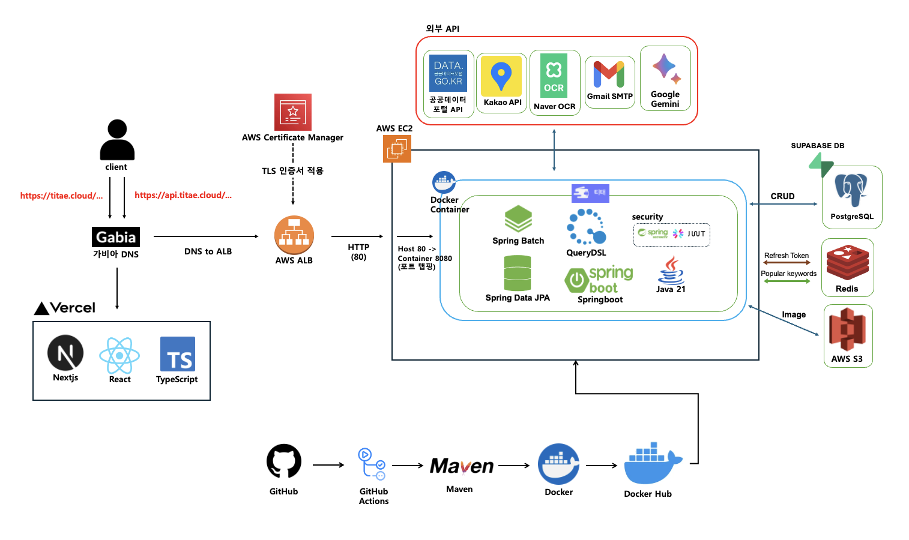

<br>

# ✏️ 7. ERD

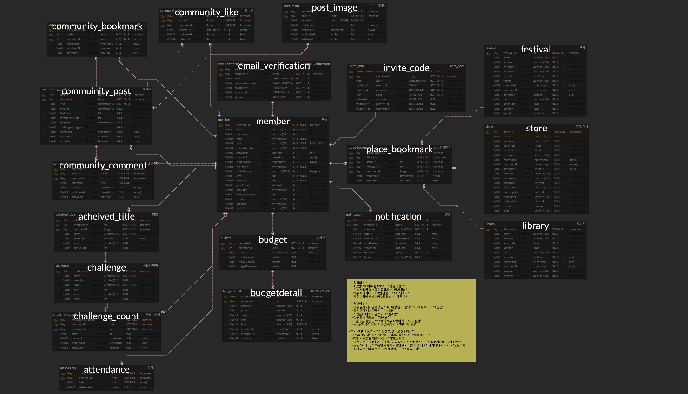

> [ERDCloud 바로가기](https://www.erdcloud.com/d/GHbgG8Aiexeot4iXi)

<br>

# ✏️ 8. API 명세서

Swagger를 통해 전체 API 명세를 확인할 수 있습니다.<br>
https://api.titae.cloud/swagger-ui.html

### 공통 응답 포맷
```json
{
  "code": "2000",
  "message": "성공",
  "data": { }
}
```
<br>

# ✏️ 9. 플로우차트

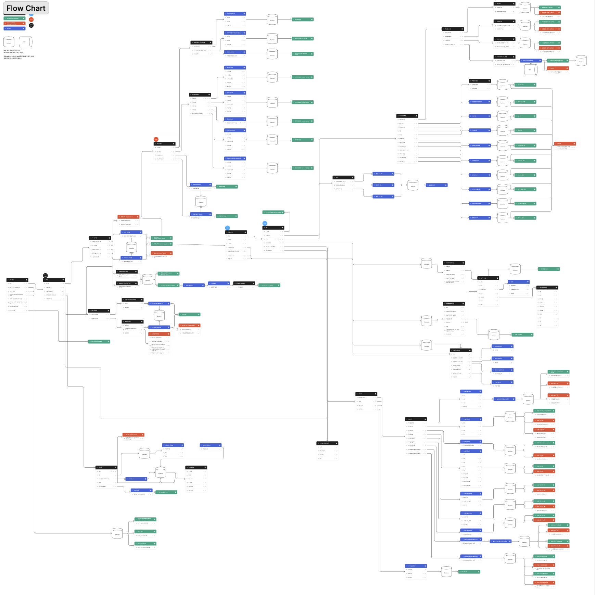

> [Figma 바로가기](https://www.figma.com/board/0oV6CUqQ6HewollVZiMudQ/titae---flow-chart?node-id=0-1&t=tl5aKkh5ugPBsTNz-1)

<br>

# ✏️ 10. 화면정의서

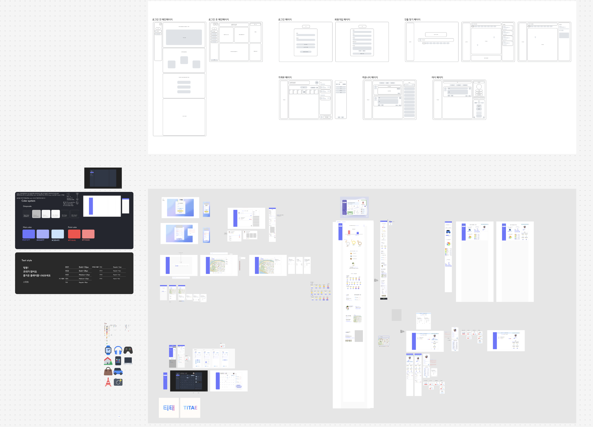

> [Figma 바로가기](https://www.figma.com/board/w8O4tOL8U8WC3uWnwagJnU/titae---%ED%99%94%EB%A9%B4%EC%A0%95%EC%9D%98%EC%84%9C?node-id=0-1&t=NIQRBgIWZhld32M8-1)

<br>

# 🕹️ 11. 실행 방법

### 사전 요구사항
- Java 21
- Maven 3.x
- PostgreSQL
- Redis

### 로컬 실행

**1. 저장소 클론**
```bash
git clone https://github.com/{organization}/titae.git
cd titae
```

**2. 환경변수 설정**

`src/main/resources/application-local.properties` 파일에 아래 값을 설정합니다.

```properties
# Database
spring.datasource.url=jdbc:postgresql://{HOST}:{PORT}/{DB_NAME}
spring.datasource.username={DB_USERNAME}
spring.datasource.password={DB_PASSWORD}

# Redis
spring.data.redis.host={REDIS_HOST}
spring.data.redis.port={REDIS_PORT}
spring.data.redis.password={REDIS_PASSWORD}

# JWT
jwt.secret={JWT_SECRET}

# AWS S3
cloud.aws.s3.bucket={S3_BUCKET}
cloud.aws.region.static=ap-northeast-2
cloud.aws.credentials.access-key={AWS_ACCESS_KEY}
cloud.aws.credentials.secret-key={AWS_SECRET_KEY}

# Google OAuth2
spring.security.oauth2.client.registration.google.client-id={GOOGLE_CLIENT_ID}
spring.security.oauth2.client.registration.google.client-secret={GOOGLE_CLIENT_SECRET}

# Gemini AI
gemini.api.key={GEMINI_API_KEY}

# Naver OCR
naver.ocr.invoke-url={NAVER_OCR_URL}
naver.ocr.secret-key={NAVER_OCR_SECRET}
```

**3. 빌드 및 실행**
```bash
./mvnw spring-boot:run -Dspring.profiles.active=local
```

**4. Swagger 접속**
```
http://localhost:8083/swagger-ui.html
```

---

### Docker 실행

```bash
# 빌드
./mvnw clean package -DskipTests

# Docker 이미지 빌드
docker build -t titae-backend .

# 컨테이너 실행
docker run -d \
  -p 8080:8080 \
  -e SPRING_PROFILES_ACTIVE=prod \
  -e DB_URL={DB_URL} \
  -e DB_USERNAME={DB_USERNAME} \
  -e DB_PASSWORD={DB_PASSWORD} \
  -e JWT_SECRET={JWT_SECRET} \
  -e AWS_ACCESS_KEY_ID={AWS_ACCESS_KEY} \
  -e AWS_SECRET_ACCESS_KEY={AWS_SECRET_KEY} \
  -e AWS_BUCKET={S3_BUCKET} \
  titae-backend
```
